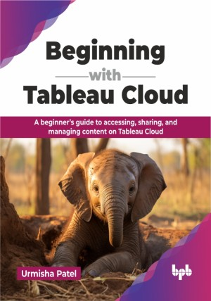

# Beginning with Tableau Cloud

A beginner’s guide to accessing, sharing, and managing content on Tableau Cloud .

This is the repository for [Beginning with Tableau Cloud
](https://bpbonline.com/products/beginning-with-tableau-cloud?variant=44323119235272),published by BPB Publications.

## About the Book
Beginning with Tableau Cloud is the essential toolkit for crafting intuitive and high-performance visuals over the web. This book provides a practical understanding of building, managing, and deploying workbooks on Tableau Cloud. 

This book explores Tableau’s cloud platform, starting with the basics of data visualization and connecting to diverse sources, including live connections and efficient data extracts. It covers creating charts from simple bar graphs to advanced visualizations like dual-axis charts and LOD calculations. Readers will learn to enhance dashboards with interactive features like parameters, actions, and animations. The book also focuses on managing content, sharing dashboards, setting up alerts, handling site administration, user management, and data security. Practical challenges such as troubleshooting connectivity, refresh issues, and optimizing performance are addressed. Real-world projects included in the chapters will help readers apply their skills to analyze complex datasets, craft engaging dashboards, and effectively communicate data insights.

This book helps BI developers to understand their roles and responsibilities. It also helps to leverage their Tableau capabilities to become Cloud server site administrators. Furthermore, you will gain the skills to effectively manage, share, and collaborate on your work, driving data-driven decision-making within your organization.

## What You Will Learn
• Master Tableau Cloud functionalities and services.

• Build secure, interactive, and intuitive dashboards and stories on the cloud. 

• Deploy and manage data sources and workbooks on the web.

• Manage published content, learn how to secure data, and troubleshoot frequently occurring issues on the Cloud.

• Managing user security and privileges. 
